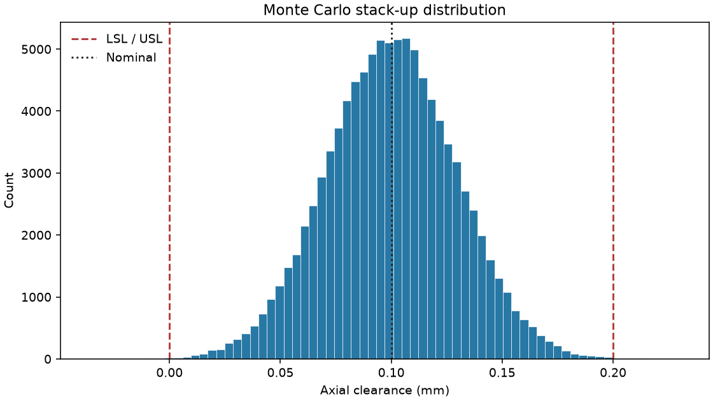

# Informe de acumulación de tolerancias

## Conjunto y modelo

Hypothetical axial clearance: housing span minus bearing width and spacer thickness. Todas las dimensiones están en milímetros. Se modela una cadena unidimensional
con contribuciones independientes; no se modelan deformación, temperatura ni incertidumbre de
medida.

| Componente | Nominal (mm) | Tolerancia bilateral (mm) | Dirección |
|---|---:|---:|---:|
| Housing span | 35.000 | ±0.080 | +1 |
| Bearing width | 10.000 | ±0.020 | -1 |
| Spacer thickness | 24.900 | ±0.030 | -1 |

La especificación para Axial clearance es [0.000, 0.200] mm (LSL–USL), según
la definición de entrada; no representa necesariamente un plano o norma de fabricante.

## Resultados

| Método / estadístico | Resultado |
|---|---:|
| Nominal | 0.100000 mm |
| Worst-case | -0.030000 a 0.230000 mm |
| Tolerancia worst-case | ±0.130000 mm |
| RSS | ±0.087750 mm |
| Monte Carlo | 100,000 muestras; seed 20260925 |
| Media simulada | 0.099984 mm |
| Desviación estándar muestral | 0.029320 mm |
| Mínimo / máximo simulados | -0.035952 / 0.230070 mm |
| Dentro de especificación | 99.9450% (99945) |
| Fuera de especificación | 0.0550% (55) |
| Cp / Cpk | 1.1369 / 1.1367 |

## Hipótesis e interpretación

- Worst-case suma aritméticamente todas las magnitudes de tolerancia; cubre cualquier combinación
  de extremos si las cotas y el modelo geométrico son correctos.
- RSS es la raíz de la suma de cuadrados de las tolerancias. Es una estimación estadística para
  contribuciones independientes y centradas, no un límite garantizado worst-case.
- Monte Carlo usa normales independientes centradas en cada nominal y supone que cada tolerancia
  bilateral equivale a ±3σ. Las normales no se truncan: algunas muestras pueden exceder tolerancias.
  La seed permite repetir esta realización; otro número de muestras/seed puede cambiarla.
- Cp = (USL−LSL)/(6s), Cpk = min((USL−media)/(3s), (media−LSL)/(3s)), con desviación muestral s.
  Resumen la dispersión y el centrado del modelo normal simulado. Requieren un proceso estable,
  datos representativos y supuestos de distribución apropiados para interpretarse como capacidad.

## Conclusión técnica prudente

Los límites worst-case exceden la especificación. La fracción fuera de especificación y Cp/Cpk describen únicamente la simulación indicada en este informe. Revisar diseño, tolerancias y datos representativos antes de decidir; no demuestra capacidad de fabricación.

Los resultados son sintéticos y educativos. No constituyen validación metrológica ni estudio de
capacidad de proceso real; no certifican producción ni sustituyen datos medidos, análisis de
estabilidad, correlación, sistema de medición o revisión de ingeniería.
